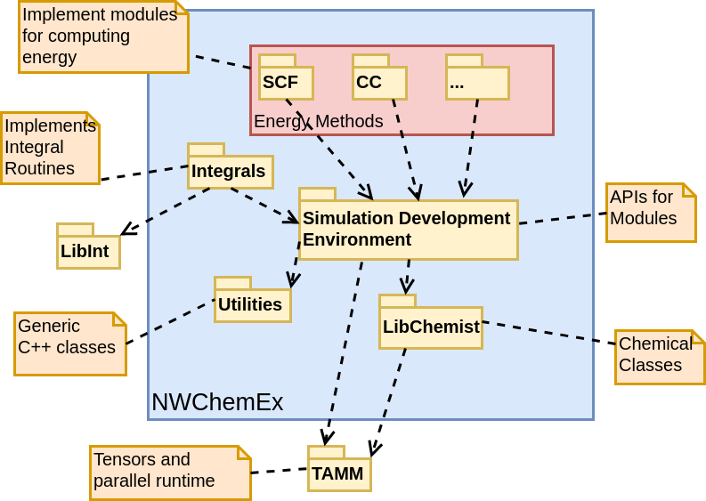

# NWChemEx

[Documentation](https://nwchemex-project.github.io/NWChemEx)

## About This Repo

First a tiny-bit of background.  NWChemEx attempts to break from the 
traditional "monolithic" electronic structure package by decomposing the overall
electronic structure package into smaller, independent packages called modules.  
Each module is its own GitHub repository and can be used as is, without the rest
of NWChemEx (aside from its dependencies).  The current module structure of 
NWChemEx is summarized in the following diagram:
 

 
For the most part, modules only depend on NWChemExRuntime and its dependencies 
(which we intend to keep minimal beyond standard dependencies such as BLAS and
MPI).  All other modules get what they need from NWChemExRuntime via abstract 
base classes.  Within NWChemEx these abstract base classes are implemented 
via the various modules; however, users are free to substitute their own 
modules.  For example, all routines needing integrals use the integral API 
defined in NWChemExRuntime; one possible integrals implementation 
is provided by IntegralsEx, but users do not have to use it.  This is similar
to how one can (in theory) substitute various vendor BLAS libraries without 
modifying the code.

The current repo serves as the public face of the NWChemEx software suite.  It
is capable of building all of the various submodules and assembling them.  
Additionally, this repo provides tools to interact with the resulting 
software suite in a number of ways. 

## Building

TODO: Turn into more formal instructions

### Prerequisite: Dependenciess

NWX depends on Boost, BLAS, LAPACK, MPI, and Libint2 and is not capable of
building these depdencies on its own. Thus you will need to build and install
them on your machine prior to attempting to build NWX.

- Boost is used by TiledArray
- BLAS/LAPACK are detected by MADNESS through TiledArray. Instructions are
  located
  [here](https://github.com/ValeevGroup/tiledarray/blob/master/INSTALL.md).
- Path to Libint2 is passed to CMake by including it in CMAKE_PREFIX_PATH

### Recomendations: Toolchain File

It is strongly recommended that you put all options you need to pass to CMake in
a toolchain file and tell CMake to use that file, *e.g*, if you have the
toolchain file:

```.cmake
set(CMAKE_C_COMPILER /usr/bin/gcc)
set(CMAKE_CPP_COMPILER /usr/bin/g++)
#Lots of other CMake options follow
```

that has path `/path/to/my_toolchain.cmake` tell CMake about it like:

```.sh
cmake -DCMAKE_TOOLCHAIN_FILE=/path/to/my_toolchain.cmake
```

### Running jobs

NWX is really designed to be driven from Python. At the moment the Python API is
a work in progress and NWX can only be reliably driven from C++. The easiest way
to drive NWX from C++ is the "Driving NWX from C++" unit test. This test is
built when you build the test suite. To enable building of the test suite pass
`BUILD_TESTING=TRUE` to CMake.


